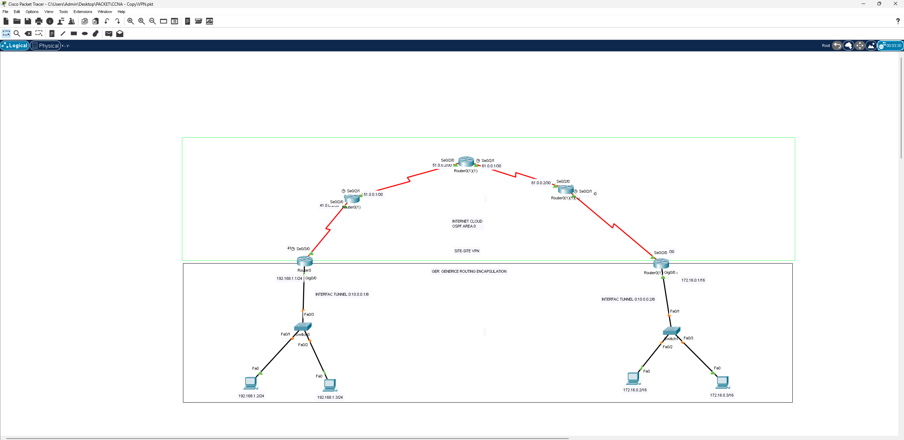

# VPN Site-to-Site (GRE over OSPF)

## 📖 الوصف
مشروع يطبق **VPN من نوع Site-to-Site** لربط موقعين بعيدين بأمان عبر شبكة عامة (Internet Cloud)، باستخدام تقنية **GRE (Generic Routing Encapsulation)** فوق شبكة OSPF.

## 🗺️ التصميم (Topology)

الشبكة مقسّمة لطبقتين:
- **الطبقة العلوية (Internet Cloud)**: 4 راوترات ISP مترابطة عبر روابط Serial (`51.0.0.0/30`, `61.0.0.0/30`, `41.0.0.0/30`) تدير التوجيه بينها عبر **OSPF Area 0**
- **الطبقة السفلية (المواقع المحلية)**: موقعان — الأول بشبكة `192.168.1.0/24` والثاني بشبكة `172.16.0.1/16` — كل منهما متصل بموجّه الحافة (Edge Router) الخاص به

### إعداد النفق (Tunnel)
- الموقع الأول: `Tunnel 0: 10.0.0.1/8`
- الموقع الثاني: `Tunnel 0: 10.0.0.2/8`

## ⚙️ المفاهيم المطبقة
- إعداد نفق **GRE** بين موجهي الحافة في الموقعين لإنشاء اتصال VPN منطقي
- تشغيل **OSPF** على شبكة الإنترنت الوسيطة لضمان وصول موجهي الحافة لبعضهما
- تمرير حركة مرور الشبكتين المحليتين (`192.168.1.0/24` و `172.16.0.0/16`) عبر النفق الآمن
- فهم الفرق بين نفق GRE البسيط ونفق IPsec VPN المشفّر

## 🎯 الهدف من المشروع
محاكاة سيناريو واقعي لشركة لها فرعان بعيدان جغرافيًا وتحتاج لربط شبكاتهما الداخلية بأمان عبر الإنترنت كأنهما شبكة واحدة، باستخدام تقنية VPN من نوع Site-to-Site.

## 📂 الملف
- [`VPN-Site-to-Site.pkt`](./VPN-Site-to-Site.pkt) — ملف Packet Tracer الكامل
